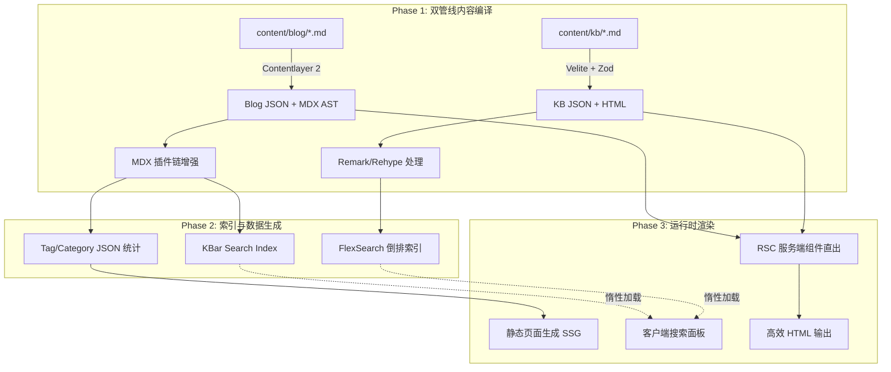

<div align="center">

# COT // 序栈

**知行合一，缄默前行。**<br>
*Knowledge is Practice. Silence is Momentum.*

<br>

[](https://nextjs.org)
[](https://react.dev)
[](https://www.typescriptlang.org)
[](https://tailwindcss.com)
[](./LICENSE)

一个基于 Next.js 16 App Router 构建的高性能全栈技术博客与知识库系统。<br>
将博客文章、底层知识库、离线全量搜索、归档、标签分类、友链生态、多语言支持与 SEO 自动化管线无缝整合。

**[在线预览 blog.cot.wiki](https://blog.cot.wiki)** · [报告 Bug / 提交 Issue](https://github.com/kerntau/blog/issues)

</div>

---

## 01. 系统理念

**序栈（COT）** 是一个面向网络安全、底层原理与全栈架构演进的技术知识沉淀系统。

- **编译期定型**：以静态预编译与构建期索引替代运行时繁重查询。
- **本地化离线检索**：利用 FlexSearch 离线倒排索引，无需依赖外部 SaaS 检索服务。
- **纯文本驱动**：全量内容基于 Markdown / MDX 文件管理，版本控制即知识库记录。
- **极致工程设计**：服务端组件直出 (RSC) 与严苛的 Client Boundary 控制，首屏 Zero-JS 骨架加载。

---

## 02. 内核架构



### 双管线内容引擎

| 管线 | 引擎 | 数据源 | 产物目录 | 核心能力 |
|:-----|:-----|:-------|:---------|:---------|
| **博客** | Contentlayer 2 | `content/blog/**/*.md` | `.contentlayer/generated/` | MDX 渲染、Tag/Category 自动统计、KBar 索引导出、RSS 订阅源 |
| **知识库** | Velite | `content/kb/**/*.md` | `.velite/` | Zod Schema 类型校验、TOC 结构提取、类型安全 JSON |

### MDX 插件链

```text
Remark 层:
  remarkGfm                    → GFM 表格 / 任务列表 / 删除线
  remarkAlert                  → GitHub Alerts 注释块 (> [!NOTE] / [!WARNING])
  remarkCodeTitles             → 代码块标题 (title="xxx")
  remarkProxyExternalImages    → 外部图片代理与懒加载优化
  remarkImgToJsx               → 自动转换为 JSX 图片组件

Rehype 层:
  rehypeRemoveFirstH1          → 自动剔除正文重复的首个 H1
  rehypeSlug                   → 生成语义化标题锚点 ID
  rehypePrettyCode             → Shiki 语法高亮（支持行高亮与代码差分）
  rehypeOptimization           → HTML 结构极致压缩与格式化
```

---

## 03. 核心功能特性

| 模块 | 技术选型 | 实现细节 |
|:-----|:---------|:---------|
| **全量检索** | `FlexSearch` + `KBar` | 预编译阶段抽取文本序列化为离线倒排索引 JSON，客户端惰性按需加载，提供 120ms 防抖与中英双语分词。 |
| **渲染管线** | `RSC` (React Server Components) | 严格限制 Client 边界。除搜索弹窗、主题切换与动画展示外，所有骨架由服务端直出，极低 Client JS 开销。 |
| **多语言** | `.en.md` 拓展名 + `LanguageContext` | 中英文内容同源存储，根据 `.en.md` 识别英文版本。UI 词条字典全局注入，支持路由与手动无缝切换。 |
| **SEO 全链路** | `sitemap.ts` + `robots.ts` + `jsonld.ts` | 动态生成标准 XML Sitemap、robots.txt、Structured Data (JSON-LD)、Open Graph / Twitter Card 共享图与 IndexNow 收录推送。 |
| **微交互** | `GSAP` + `Framer Motion` | ScrollTrigger 驱动平滑视差与滚动入场，Framer Motion 负责页面过渡与组件反馈，完整适配 `prefers-reduced-motion`。 |
| **图片管线** | `image-proxy` + `LazyLoad` | 自动代理第三方图片避免防盗链；构建期注入 `loading="lazy"` 属性；支持 Open Graph 分享图适配。 |

---

## 04. 源码目录拓扑

```text
.
├── blog.config.ts                 # 全局单源配置文件（站点元信息、SEO、OG分享图、页脚与导航）
├── contentlayer.config.ts         # 博客内容模型 + MDX 插件链 + Tag/Category 编译逻辑
├── velite.config.ts               # 知识库内容模型 (Zod Schema)
├── deploy.sh                      # VPS 自动化构建部署脚本
├── ecosystem.config.cjs           # PM2 守护进程配置
│
├── content/                       # Markdown 知识源
│   ├── blog/                      # ├─ 博客文章（.md 中文 / .en.md 英文）
│   ├── kb/                        # └─ 知识库文档
│   └── authors/                   #    作者个人信息
│
├── scripts/                       # 构建与处理脚本
│   ├── build/                     # ├─ postbuild.ts / prepare-generated-content.ts / rss.ts
│   ├── build-search-index.js      # ├─ FlexSearch 离线索引生成器
│   └── seo-push.ts               # └─ 搜索引擎主动推送脚本
│
├── src/
│   ├── app/                       # Next.js App Router 路由层
│   │   ├── (site)/                # ├─ 博客主站（首页、文章、标签、归档、友链、关于）
│   │   ├── (app)/                 # ├─ 知识库视图 (Wiki Shell)
│   │   └── api/                   # └─ API 接口
│   │
│   ├── features/                  # 业务功能组件
│   │   ├── content/               # ├─ 内容渲染引擎与转换适配器
│   │   ├── site/                  # ├─ 站点基础组件（Header、Footer、Hero、SEO）
│   │   ├── search/                # ├─ KBar 检索面板
│   │   └── friends/               # └─ 友链模块
│   │
│   ├── shared/                    # 共享工具库与 UI 通用组件
│   └── generated/                 # 编译期自动导出的 JSON 索引数据
│
├── public/                        # 静态资源、OG分享图、Favicon、搜索索引
└── storage/                       # 动态/本地持久化配置存储
```

---

## 05. 快速开发与构建

### 环境要求
- **Node.js**: `>= 20.0.0`
- **pnpm**: `>= 9.0.0`

### 本地开发

```bash
# 1. 克隆仓库
git clone https://github.com/kerntau/blog.git
cd blog

# 2. 安装依赖
pnpm install

# 3. 启动开发服务器（自动构建数据与 Contentlayer 模组）
pnpm dev

# 4. 如果遇到缓存错乱，执行深度清理并启动
pnpm dev:clean
```

访问地址: `http://127.0.0.1:3000`

### 常用命令脚本

| 命令 | 说明 |
|:-----|:-----|
| `pnpm dev` | 启动开发服务器（自动准备数据与 Contentlayer 构建） |
| `pnpm dev:clean` | 清理 `.next-dev`、`.contentlayer` 缓存并重新启动 |
| `pnpm build` | 完整编译产物（生成索引、MDX、SSG 静态页面及 RSS） |
| `pnpm typecheck` | 执行 TypeScript 全量类型检查 |
| `pnpm lint` | 执行 ESLint 代码规范检查与自动修复 |

---

## 06. 部署指南

### 方案 A：VPS / Node 服务器部署（PM2 + Standalone）

运行自引导部署脚本：
```bash
chmod +x deploy.sh && ./deploy.sh
```
该脚本将完成 Node/pnpm 环境检查、依赖锁校验、资源构建、PM2 进程守护与健康检查全流程。

### 方案 B：静态托管（EdgeOne / Vercel / Cloudflare Pages）

执行静态导出构建：
```bash
STATIC_EXPORT=true pnpm build
```
编译产物将置于 `out/` 目录，直接上传至静态托管平台即可。

---

## 07. 配置文件规范

全站大部分元信息集中维护于 **`blog.config.ts`**：

```ts
site          // 站点名称、域名、描述、语言与 Repo
branding      // Logo、Favicon、OG分享图路径 (/og-image.jpg)
navigation    // 顶部导航与下拉菜单配置
presentation  // Hero 区域欢迎语、头像配置与社交链接样式
```

---

## 08. 许可协议

本项目遵循 [GPL-3.0 License](./LICENSE) 开源协议。
